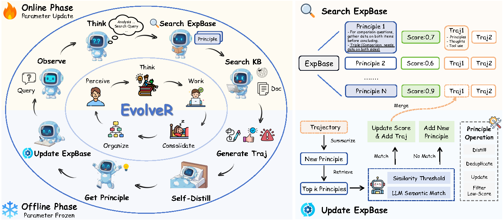

<div align="center">

# EvolveR: Self‑Evolving LLM Agents through an Experience‑Driven Lifecycle
</div>
<p align="center">
    <!-- Paper & License -->
    <a href="URL_TO_ARXIV_PAPER" target="_blank">
        
    </a>
    <a href="LICENSE" target="_blank">
        
    </a>
    <!-- Hugging Face Resources -->
    <a href="https://huggingface.co/Edaizi/EvolveR" target="_blank">
        
    </a>
    <a href="https://huggingface.co/datasets/Edaizi/EvolveR-NQ-HotpotQA" target="_blank">
        
    </a>
</p>

This repository contains the official implementation of **EvolveR**, a framework enabling LLM agents to self-improve through a closed-loop experience lifecycle, where they distill abstract principles from past trajectories and retrieve them to guide future actions.


<div align="center">
    
</div>

---

## 📰 Updates
- **`2025-10-20`**: Codebase is publicly available.

## 🎯 Getting Started

### Installation
We recommend using Python 3.10 and Conda for environment management.
```bash
# 1. Clone the repository
git clone https://github.com/Edaizi/EvolveR.git
cd EvolveR

# 2. Create and activate conda environment
conda create -n evolver python=3.10 -y
conda activate evolver

# 3. Install dependencies
pip install -r requirements.txt 
```

### 🗄️ Data Preparation
We will provide the processed data on Hugging Face Hub. You can download it from the following link:

- **[EvolveR-Data](https://huggingface.co/datasets/Edaizi/EvolveR-NQ-HotpotQA)** 

Place your training and validation data in the following structure. The provided training script uses this path by default.
```
./data/nq_hotpotqa_train/
├── train.parquet
└── test.parquet
```
You can modify the `DATA_DIR` variable in `scripts/train_grpo-3b.sh` to point to your dataset location.

## 🚀 Training

Execute the main training script. It contains all necessary configurations for GRPO training.
```bash
bash scripts/train_grpo-3b.sh
```
The script will handle all training steps, including lauching Launching Experience Vector Database (VDB), interacting with the Experience VDB.


## 🤗 Model Zoo
For those with limited resources or who wish to bypass the training process, we provide direct access to our open-sourced model weights on the Hugging Face Hub.

<div align="center">

| Model      | Base Architecture | Params | Hugging Face Hub Link                         |
|:----------:|:-----------------:|:------:|:---------------------------------------------:|
| EvolveR-3B | Qwen2.5           | 3B     | [Link](https://huggingface.co/Edaizi/EvolveR) |

</div>

## 🚀 Vision & Community
We believe the experience-driven lifecycle of EvolveR is a generalizable paradigm for agent self-improvement. We encourage and welcome the community to extend this framework to other exciting domains, such as `code generation`, `mathematical reasoning`, and beyond. We are excited to see what you build!

## Acknowledgements
We would like to thank the developers of the following projects for their open-source contributions.
- [Qwen2.5](https://github.com/QwenLM/Qwen3/tree/v2.5)
- [Search-R1](https://github.com/PeterGriffinJin/Search-R1)
- [O2-Searcher](https://github.com/KnowledgeXLab/O2-Searcher)

<!-- ## Citation
If you find our paper and code useful, please kindly cite us. A BibTeX entry will be provided upon publication.
```bibtex
@misc{your_paper_2025_evolver,
    title={EvolveR: Self-Evolving LLM Agents through an Experience-Driven Lifecycle},
    author={Your Name and Co-authors},
    year={2025},
    eprint={XXXX.XXXXX},
    archivePrefix={arXiv},
    primaryClass={cs.AI}
}
``` -->
